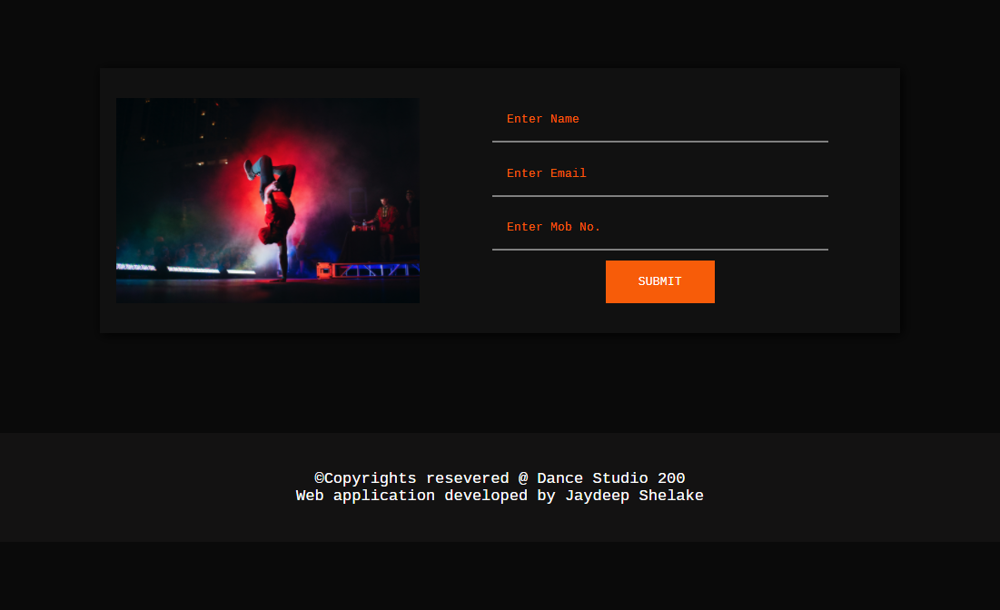

# nodejs-dance-website

  

 

> This web application is made for  a dance club and web page has great UI and UX

## ⚙️ Detailed Functionality
* From this web application any one  can acsess Dance studio website and get info about studio
* Clients can fill the contact form and give their information like name email and contact details
* And it will be stored in the database
 
## 🚀 Tech and Tools Used

* HTML,CSS and javascript
* Node.js , express.js and Mongodb
* VS code

## 📸 Screenshots
### home page

### contact page

link:https://node-dancejs.herokuapp.com/
